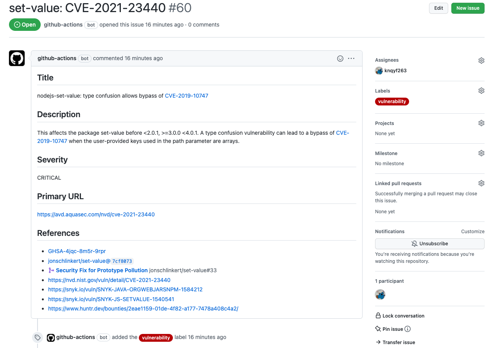

# trivy-issue-action
In this action, [Trivy](https://github.com/aquasecurity/trivy) scans the dependency files such as package-lock.json and go.sum in your repository, then create GitHub issues according to the result.

## Image


## Usage

```
- uses: knqyf263/trivy-issue-action@v0.0.6
  with:
    # Label name
    # Default: vulnerability (this label must be created in advance)
    label: ''

    # Severities of vulnerabilities to be registered to GitHub Issues
    # Default: 'CRITICAL'
    severity: ''
    
    # Comma separated list of directories where traversal is skipped
    # Default: ''
    # Example: 'tests, integration-tests'
    skip-dirs: ''

    # Assignees
    # Default: ''
    # Example: 'monalisa,hubot'
    assignee: ''

    # Project ID to which the created Issue will be tied.
    # Default: ''
    project-id: ''
```
